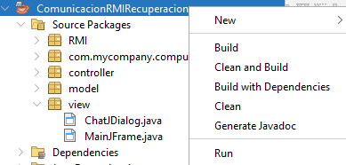
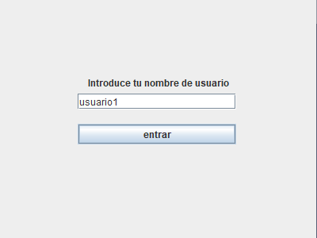
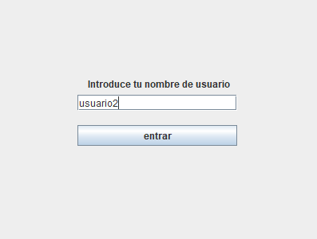
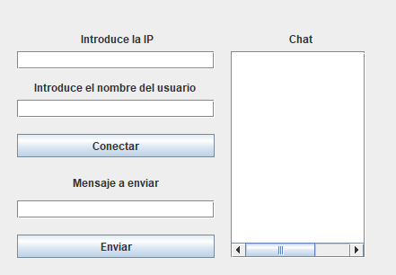
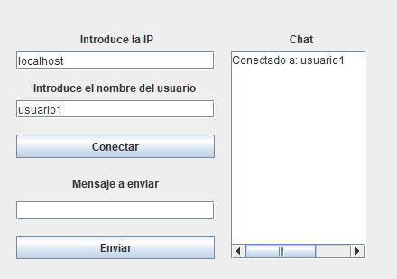

<h1 align="center">Comunicación RMI</h1>

Iván Duro Fernández

## Índice
- [Breve Explicación](#breve-explicación)
- [Requisitos del Proyecto](#requisitos-del-proyecto)
- [Estructura del proyecto](#Estructura-del-proyecto)
- [Explicación de funcionalidades](#explicación-de-funcionalidades)

- - -

## Breve Explicación

Aplicación que simula un pequeño chat entre dos usuarios introduciendo su  nombre, la ip y el mensaje a enviar

- - -

## Requisitos del Proyecto

1. **Java 25** - El proyecto se realizó utilizando Java 25, por lo que para su ejecución se recomienda ejecutarlo en esa versión o en versiones futuras superiores a ella
2. **Maven** - También cabe destacar que se completo en Maven
3. **Netbeans** - Por útlimo, se utilizó el IDE Netbeans en el que se escribió el código y se añadiron las interfaces gráficas, por lo que se recomienda, aunque no es necesario, utilizar este IDE para su ejecución

- - -

## Estructura del proyecto

La estructura del proyecto tiene los siguiente paquetes y clases relizados en un modelo MVC - Modelo, Vista y Controlador:

- 📦 **com.mycompany.comunicacionrmirecuperacion**
  - 📄 ComunicacionRMIRecuperacion.java
- 📦 **RMI**
  - 📄 ChatService.java
  - 📄 ChatServiceImplementation.java
- 📦 **controller**
  - 📄 ChatController.java
  - 📄 FrontController.java
- 📦 **model**
  - 📄 Mensaje.java
- 📦 **view**
  - 📄 ChatJDIalog.java
  - 📄 MainJFrame.java
- - -

## Explicación de funcionalidades

Para ejecutar el proyecto y ver que el chat está bien implementado, pues se ejecutará el proyecto dos veces, simulando así dos personas teniendo una conversación por chat. Para realizar esto, habrá que pinchar con click derecho en el proyecto y a Run, como se muestra la imagen, así hasta en dos ocasiones para tener esa conversación

  

Una vez que está e proyecto en ejecución, nos indica que introduzcamos nuestro nombre de usuario para entrar en el chat, en la imágen de abajo se muestra el nombre de los dos usuarios

  
  

Con los nombres ya indicados se nos abré la ventana donde se establecerá la conversación. En esta ventana podemos ver a la derecha un **TextArea** en la que se verán nuestros mensajes y los mensajes de la otra persona de la conversación. Y a la izquierda se ven varios campos, el primero será para introducir la IP con el nombre de la persona a la que queremos enviar un mensaje con el botón de conectar. Y más abajo tenemos el campo donde se escribirá el mensaje con su respectivo botón de enviar

  

Un ejemplo de una conversación sería introducir en el campo IP **localhost**, ya que la conversación entre los dos usuarios, será de forma local desde el mismo ordenador y el nombre del usuario al que queremos enviar el mensaje. Uana vez le demos al botón de conectar, en el chat nos aparecerá que estámos conectados al usuario que le queremos enviar un mensaje

  

Y para enviar un mensaje 
